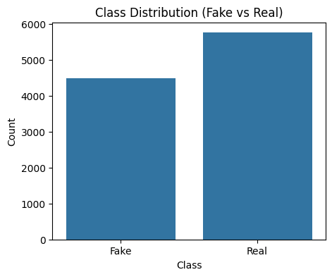

# 📰 Fake News Detection System

A Machine Learning project to classify news articles as **Fake or Real** using Natural Language Processing (NLP) and supervised learning techniques.

---

##  Project Structure
```bash

Fake News Detection/
│
├── app.py
├── model.pkl
├── vectorizer.pkl
│
├── templates/
│     └── index.html
│
├── static/
│     └── style.css
│
├── images/
│   ├── Confusion Matrix.png
│   ├── ROC Curve.png
│   └── Top words indicating FAKE news.png
│
├── requirements.txt
├── Procfile
└── README.md
```

---

##  Description

- **Data** → Contains training, validation, and testing datasets in TSV format.
- **Notebooks** → Used for data exploration and model experimentation.
- **Scripts** → Modular Python scripts for complete ML pipeline:
  - Data preprocessing
  - Model training
  - Model evaluation
  - Prediction
- **Outputs** → Visual results such as confusion matrix and ROC curve.
- **Requirements** → List of dependencies required to run the project.

---

##  Installation

### 🔹 Clone the repository
```bash
git clone https://github.com/SankarapuKavya/FakeNewsDetection.git
```

##  Move into project directory

```bash
cd FakeNewsDetection
```

## Install dependencies

```bash
cd FakeNewsDetection
```

## How to Run

### Train the model
```bash
python scripts/train_model.py
```

### Evaluate the model
```bash
python scipts/evaluate.py
```

### Make predictions
```bash
python scripts/predict.py
```

## 📊 Model Visualizations

### Class Distribution in Training Data


### Confusion Matrix


### Statement Length Distribution by Class


### Text Length by Class


### Overall Class Distribution

---

##  Tech Stack

- Python   
- Scikit-learn   
- Pandas & NumPy  
- NLP (TF-IDF Vectorization)  
- Matplotlib & Seaborn  
- Flask (for deployment)  

---

##  Live Demo

 https://your-render-app.onrender.com
